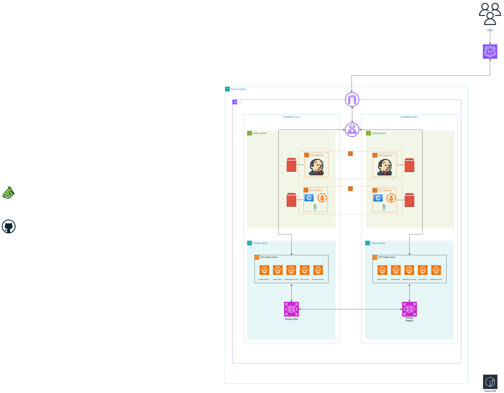
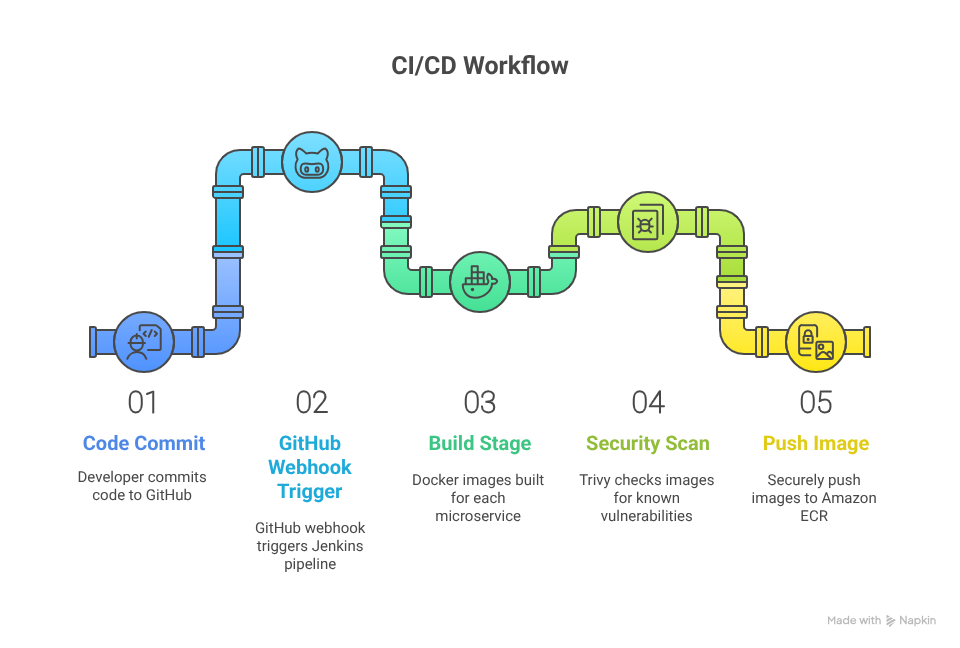

# Main Infrastructure Tier

This repository contains the Terraform configurations for deploying a secure, highly available, and cost-effective AWS infrastructure for a microservices-based task management application. The infrastructure supports both primary and disaster recovery environments, implementing modern cloud-native architecture with containerized services, CI/CD pipeline, and comprehensive monitoring.



## 🏗️ Architecture Overview

The infrastructure is designed as a multi-tier, cloud-native architecture featuring:

- **Microservices Architecture**: 5 containerized services (Frontend, User Service, Task API, Notification Service, Kafka)
- **Container Orchestration**: AWS ECS with Fargate and Fargate Spot capacity providers
- **Load Balancing**: Application Load Balancer with multiple listeners for different services
- **Database**: RDS PostgreSQL with Multi-AZ deployment for high availability
- **Storage**: EFS for persistent data with cross-region replication
- **CI/CD**: Jenkins with ECR integration for automated deployments
- **Monitoring**: Prometheus, Grafana, and Jaeger for observability
- **Security**: VPC with private subnets, security groups, and IAM roles following least privilege




## 📁 Repository Structure

```
main-infra/
├── terraform/
│   ├── environments/
│   │   ├── primary/          # Primary region infrastructure
│   │   └── dr/               # Disaster recovery region infrastructure
│   └── modules/              # Reusable Terraform modules
│       ├── alb/              # Application Load Balancer
│       ├── asg/              # Auto Scaling Groups
│       ├── cloudwatch/       # CloudWatch monitoring
│       ├── ecs/              # Elastic Container Service
│       ├── efs/              # Elastic File System
│       ├── iam/              # Identity and Access Management
│       ├── lambda/           # Lambda functions
│       ├── rds/              # Relational Database Service
│       ├── secrets-manager/  # AWS Secrets Manager
│       ├── security-group/   # Security Groups
│       └── vpc/              # Virtual Private Cloud
├── scripts/
│   ├── setup_terraform_backend.sh    # Backend setup automation
│   ├── teardown_terraform_backend.sh # Backend cleanup automation
│   ├── lambda/               # Lambda function code
│   └── user-data/            # EC2 initialization scripts
└── assets/
    └── infra-diagram.drawio.png      # Architecture diagram
```

## 🚀 Quick Start

### Prerequisites

- AWS CLI configured with appropriate credentials
- Terraform 1.3.2 or later
- Bash shell environment

### 1. Setup Terraform Backend

```bash
# Navigate to scripts directory
cd scripts

# Setup S3 backend for state management
./setup_terraform_backend.sh --prefix myproject --region eu-west-1 --output-dir ../terraform/environments/primary
```

### 2. Deploy Primary Infrastructure

```bash
# Navigate to primary environment
cd ../terraform/environments/primary

# Set required environment variables
export TF_VAR_db_password="your-secure-password"

# Initialize and deploy
terraform init
terraform plan
terraform apply
```

### 3. Access Services

After deployment, access your services using the ALB DNS name:

- **Frontend**: `http://<alb-dns-name>:3000`
- **Jenkins**: `http://<alb-dns-name>:8080`
- **Grafana**: `http://<alb-dns-name>:7001`
- **Prometheus**: `http://<alb-dns-name>:7000`
- **Jaeger**: `http://<alb-dns-name>:7002`

## 🎯 Key Features

### Infrastructure Components

- **VPC & Networking**: Multi-AZ VPC with public/private subnets and NAT Gateway
- **Container Services**: ECS cluster with 5 microservices and service discovery
- **Database**: RDS PostgreSQL with automated backups and Multi-AZ deployment
- **Load Balancing**: ALB with health checks and multiple target groups
- **Storage**: EFS with access points for Jenkins and monitoring data
- **Security**: Comprehensive security groups and IAM roles
- **Monitoring**: CloudWatch integration with custom dashboards

### Operational Excellence

- **CI/CD Pipeline**: Jenkins with automated ECR integration
- **Infrastructure as Code**: Modular Terraform design for reusability
- **Monitoring Stack**: Prometheus, Grafana, and Jaeger for full observability
- **Disaster Recovery**: Cross-region replication and failover capabilities
- **Cost Optimization**: Fargate Spot instances and right-sized resources

## 🔧 Configuration

### Environment Variables

```bash
# Required for database
export TF_VAR_db_password="your-secure-password"

# Optional customizations
export TF_VAR_vpc_cidr="10.0.0.0/16"
export TF_VAR_environment="primary"
```

### Key Variables

- `vpc_cidr`: VPC CIDR block (default: 10.0.0.0/16)
- `instance_types`: EC2 instance types for different services
- `service_min_sizes`/`service_max_sizes`: ECS auto-scaling parameters
- `db_instance_class`: RDS instance type (default: db.t3.small)

## 📊 Monitoring & Observability

The infrastructure includes a comprehensive monitoring stack:

- **Metrics Collection**: Prometheus scrapes metrics from all services
- **Visualization**: Grafana dashboards for infrastructure and application metrics
- **Distributed Tracing**: Jaeger for microservices request tracing
- **Logging**: CloudWatch Logs with structured logging for all services
- **Alerting**: CloudWatch alarms for critical infrastructure metrics

## 🔒 Security Features

- **Network Security**: Private subnets for sensitive resources
- **Access Control**: IAM roles with least privilege principles
- **Encryption**: Data encrypted at rest and in transit
- **Security Groups**: Restrictive firewall rules for each service tier
- **Secrets Management**: Secure handling of database credentials

## 💰 Cost Optimization

- **Spot Instances**: 50% of ECS tasks run on Fargate Spot
- **Right-Sizing**: Appropriately sized instances based on workload requirements
- **Storage Optimization**: gp3 volumes for better cost-performance ratio
- **Auto Scaling**: Dynamic scaling to match demand
- **Single NAT Gateway**: Cost-optimized design for non-production environments

## 🔄 Disaster Recovery

The infrastructure supports disaster recovery with:

- **Cross-Region Replication**: EFS data replicated to secondary region
- **Database Backups**: Automated RDS backups with 7-day retention
- **Infrastructure as Code**: Rapid environment recreation using Terraform
- **Lambda Failover**: Automated failover mechanisms for critical services

## 📚 Documentation

Detailed documentation is available for each component:

- [Primary Environment](terraform/environments/primary/README.md) - Complete deployment guide
- [Terraform Modules](terraform/modules/) - Individual module documentation
- [Setup Scripts](scripts/README.md) - Backend management and automation
- [User Data Scripts](scripts/user-data/) - EC2 initialization procedures

## 🛠️ Module Documentation

Each Terraform module is thoroughly documented:

- [VPC Module](terraform/modules/vpc/README.md) - Network infrastructure
- [ECS Module](terraform/modules/ecs/README.md) - Container orchestration
- [RDS Module](terraform/modules/rds/README.md) - Database management
- [IAM Module](terraform/modules/iam/README.md) - Access control
- [ALB Module](terraform/modules/alb/README.md) - Load balancing
- [Lambda Module](terraform/modules/lambda/README.md) - Serverless functions

## 🧹 Cleanup

To destroy the infrastructure:

```bash
# Destroy primary infrastructure
cd terraform/environments/primary
terraform destroy

# Cleanup Terraform backend (optional)
cd ../../../scripts
./teardown_terraform_backend.sh --prefix myproject --region eu-west-1
```

## 🤝 Contributing

1. Follow the established module structure
2. Update documentation for any changes
3. Ensure all resources are properly tagged
4. Test changes in a development environment first

## 📞 Support

For issues or questions:

1. Check the troubleshooting sections in individual README files
2. Review CloudWatch logs for service-specific issues
3. Consult AWS documentation for service limits
4. Review Terraform plan output for configuration conflicts

## 📄 License

This project is part of a capstone project for educational purposes.

---

**Note**: This infrastructure is designed for educational and development purposes. For production use, consider additional security hardening, compliance requirements, and operational procedures specific to your organization.
