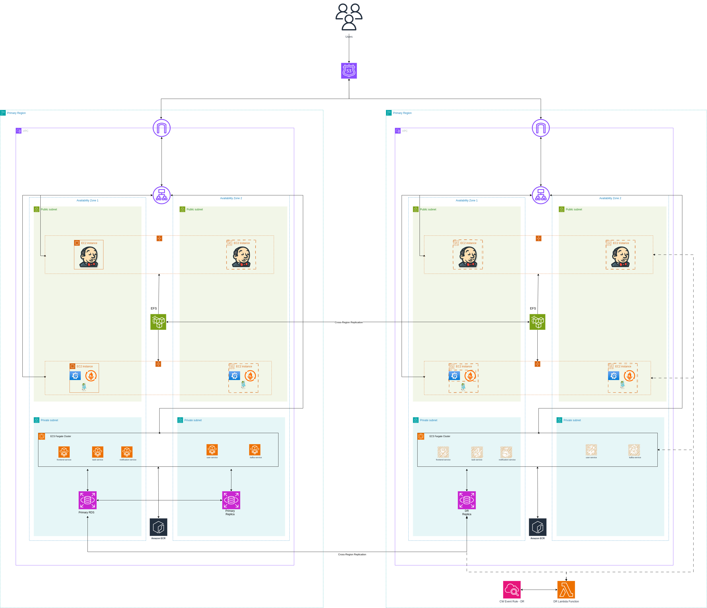

# AWS Infrastructure - Primary Environment

This directory contains Terraform configurations for deploying a secure, highly available, and cost-effective AWS infrastructure for a microservices-based task management application. The infrastructure follows AWS best practices and implements a modern cloud-native architecture with containerized services, CI/CD pipeline, and monitoring stack.

## Table of Contents

- [Architecture Overview](#architecture-overview)
- [Deployment Instructions](#deployment-instructions)
- [Infrastructure Components](#infrastructure-components)
- [Customization](#customization)
- [Security Considerations](#security-considerations)
- [Cost Optimization](#cost-optimization)
- [Monitoring and Alerting](#monitoring-and-alerting)
- [Disaster Recovery](#disaster-recovery)
- [Access and Operations](#access-and-operations)
- [Architecture Diagram](#architecture-diagram)
- [Outputs](#outputs)
- [Troubleshooting](#troubleshooting)
- [Terraform Backend](#terraform-backend)
- [Module Dependencies](#module-dependencies)
- [Compliance and Governance](#compliance-and-governance)
- [Future Enhancements](#future-enhancements)

## Architecture Overview

The infrastructure consists of the following components:

### Core Network Infrastructure

- VPC (10.0.0.0/16) with 2 public and 2 private subnets across different availability zones
- Public subnets (10.0.0.0/20) for load balancers and bastion hosts
- Private subnets (10.0.16.0/20) for application services and database
- Internet Gateway for public internet access
- Single NAT Gateway for cost optimization (private subnet internet access)
- Route tables for traffic management

### Compute Resources

- 2 Auto Scaling Groups (ASGs) for operational services:
  - Jenkins ASG (t3.small) for CI/CD pipeline
  - Monitoring ASG (t3.small) for observability stack
- Each EC2 instance has encrypted EBS volumes (Jenkins: 20GB, Monitoring: 12GB)
- Fixed scaling (min=1, max=1, desired=1) for predictable operations

### Container Services

- ECS cluster with Fargate and Fargate Spot capacity providers (50/50 split)
- 5 distinct microservices running as ECS services:
  - **Frontend Service**: React.js application (port 3000)
  - **User Service**: Spring Boot authentication service (port 9193)
  - **Task API**: Spring Boot task management service (port 9191)
  - **Notification Service**: Spring Boot notification service (port 9292)
  - **Kafka**: Apache Kafka message broker (port 9092)

### Database

- RDS PostgreSQL 17.2 instance (db.t3.small) in private subnets
- Multi-AZ deployment for high availability
- 20GB storage with auto-scaling up to 40GB
- 7-day backup retention period
- Automated maintenance windows

### Storage

- EFS file system with cross-region replication for persistent data
- Dedicated access points for Jenkins and monitoring services
- Mount targets in private subnets for secure access

### Security Components

- Security groups with least privilege access
- IAM roles with specific permissions for each service
- Encryption for data at rest and in transit
- Private subnets for sensitive resources (database, application services)

## Deployment Instructions

### Prerequisites

- AWS CLI configured with appropriate credentials
- Terraform 1.3.2 or later
- AWS provider 5.83 or later
- PostgreSQL database password (set via environment variable or terraform.tfvars)

### Environment Variables

Set the following environment variables before deployment:

```bash
export TF_VAR_db_password="your-secure-password"
```

### Deployment Steps

1. Initialize Terraform:

```bash
terraform init
```

1. Review the execution plan:

```bash
terraform plan
```

1. Apply the configuration:

```bash
terraform apply
```

1. To destroy the infrastructure:

```bash
terraform destroy
```

## Infrastructure Components

### VPC and Networking

- VPC CIDR: 10.0.0.0/16
- Public Subnets: 10.0.0.0/20 (split across 2 AZs)
- Private Subnets: 10.0.16.0/20 (split across 2 AZs)
- Single NAT Gateway: Cost-optimized design for non-production environments

### Security Groups

- **ALB Security Group**: Allows HTTP traffic on multiple ports (3000, 8080, 7000-7002, 9191-9193, 9292)
- **Jenkins Security Group**: Allows ALB traffic and SSH (22) access
- **Monitoring Security Group**: Allows ALB traffic, microservices traffic, and SSH access
- **Microservices Security Group**: Allows inter-service communication and ALB traffic
- **Database Security Group**: Allows PostgreSQL (5432) from microservices only
- **EFS Security Group**: Allows NFS (2049) from Jenkins and monitoring instances

### IAM Roles

- **EC2 Jenkins Role**: SSM, CloudWatch, and ECR permissions
- **EC2 Monitoring Role**: SSM and CloudWatch permissions
- **ECS Task Execution Role**: Image pulling and logging permissions
- **ECS Task Role**: CloudWatch Logs and SSM read permissions

### Auto Scaling Groups

- **Jenkins ASG**: t3.small instances with 20GB encrypted EBS volumes
- **Monitoring ASG**: t3.small instances with 12GB encrypted EBS volumes
- Both configured with fixed capacity (1 instance each)

### Application Load Balancer

- Application Load Balancer in public subnets
- Multiple listeners for different services:
  - Port 3000: Frontend service
  - Port 8080: Jenkins
  - Port 7000: Prometheus
  - Port 7001: Grafana
  - Port 7002: Jaeger
  - Port 9191: Task API
  - Port 9193: User service
  - Port 9292: Notification service
- Health checks configured for each target group

### ECS Services

**Microservices Architecture:**

1. **Frontend Service** (React.js)
   - Port: 3000
   - Auto-scaling: 1-3 tasks based on CPU/memory

2. **User Service** (Spring Boot)
   - Port: 9193
   - Database connectivity and Kafka integration
   - OpenTelemetry tracing enabled

3. **Task API** (Spring Boot)
   - Port: 9191
   - Database connectivity and Kafka integration
   - OpenTelemetry tracing enabled

4. **Notification Service** (Spring Boot)
   - Port: 9292
   - SNS integration and Kafka consumer
   - OpenTelemetry tracing enabled

5. **Kafka Service**
   - Port: 9092
   - KRaft mode (no Zookeeper dependency)
   - JMX metrics exporter for monitoring

**NB**: _All images are pulled from ECR which are pushed from the Jenkins Pipeline._

### RDS Database

- PostgreSQL 17.2 on db.t3.small instance
- Multi-AZ deployment for high availability
- 20GB gp3 storage with auto-scaling up to 40GB
- Database name: `appdb`
- Username: `postgres`
- Backup retention: 7 days
- Maintenance window: Monday 00:00-03:00 UTC

### EFS File System

- Encrypted file system with cross-region replication to us-east-1
- Access points for Jenkins (`/mnt/jenkins`) and monitoring (`/mnt/monitoring`)
- Proper POSIX permissions and ownership configured
- Mount targets in private subnets

### Monitoring and Observability

**Infrastructure Monitoring:**

- Prometheus for metrics collection
- Grafana for visualization dashboards
- Jaeger for distributed tracing

**Application Monitoring:**

- CloudWatch Container Insights for ECS
- CloudWatch Logs for all services
- OpenTelemetry integration for microservices
- Auto Scaling notifications

**CI/CD Pipeline:**

- Jenkins server for build automation
- ECR integration for container registry
- EFS storage for persistent Jenkins data

## Customization

The infrastructure can be customized by modifying the variables in `variables.tf`. Key variables include:

### Network Configuration

- `vpc_cidr`: CIDR block for the VPC (default: 10.0.0.0/16)
- `public_subnets_cidr`: CIDR for public subnets (default: 10.0.0.0/20)
- `private_subnets_cidr`: CIDR for private subnets (default: 10.0.16.0/20)
- `az_count`: Number of availability zones to use (default: 2)

### Compute Configuration

- `instance_types`: EC2 instance types for ASGs
  - Jenkins: t3.small
  - Monitoring: t3.small
- `asg_min_sizes`, `asg_max_sizes`, `asg_desired_capacities`: Auto scaling parameters

### Database Configuration

- `db_engine`: Database engine (default: postgres)
- `db_engine_version`: PostgreSQL version (default: 17.2)
- `db_instance_class`: RDS instance class (default: db.t3.small)
- `db_allocated_storage`: Initial storage allocation (default: 20GB)

### Service Configuration

- `service_min_sizes`: Minimum ECS tasks per service (default: 1)
- `service_max_sizes`: Maximum ECS tasks per service (default: 3)
- `port`: Service port mappings for all components

### Application Configuration

- `service_names`: Container and service names for microservices
- Container images and environment variables (configured in `data.tf`)

## Security Considerations

- **Encryption**: All data encrypted at rest using AWS managed keys
- **Network Security**: Security groups follow least privilege principle
- **Access Control**: IAM roles with minimal required permissions
- **Network Isolation**: Sensitive resources in private subnets
- **Database Security**: Database accessible only from application tier
- **Container Security**: ECS tasks run with restricted IAM roles

## Cost Optimization

- **Fargate Spot**: 50% workload on Spot instances for cost savings
- **Instance Types**: t3.small instances for cost-effective compute
- **Storage**: gp3 EBS volumes for better performance/cost ratio
- **Auto Scaling**: Dynamic scaling based on CPU/memory utilization
- **Single NAT**: Single NAT Gateway for cost optimization in non-production
- **EFS Replication**: Cross-region backup for disaster recovery

## Monitoring and Alerting

### Infrastructure Monitoring

- **Prometheus**: Metrics collection and alerting
- **Grafana**: Custom dashboards and visualization
- **CloudWatch**: AWS service monitoring and logging
- **Container Insights**: ECS cluster and service metrics

### Application Monitoring

- **Distributed Tracing**: Jaeger integration with OpenTelemetry
- **Log Aggregation**: Centralized logging via CloudWatch Logs
- **Health Checks**: ALB health checks for all services
- **Database Monitoring**: RDS performance insights

## Disaster Recovery

- **Cross-Region EFS Replication**: Automatic replication to us-east-1
- **RDS Multi-AZ**: Automatic failover for database
- **Infrastructure as Code**: Entire stack reproducible via Terraform
- **Container Registry**: ECR images available across regions

## Access and Operations

### Service Endpoints

After deployment, services are accessible via the ALB DNS name on their respective ports:

- Frontend: `http://<alb-dns>:3000`
- Jenkins: `http://<alb-dns>:8080`
- Prometheus: `http://<alb-dns>:7000`
- Grafana: `http://<alb-dns>:7001`
- Jaeger: `http://<alb-dns>:7002`
- User Service API: `http://<alb-dns>:9193/api/v1/`
- Task API: `http://<alb-dns>:9191/api/v1/tasks/`
- Notification Service: `http://<alb-dns>:9292/actuator/health/`

### Database Access

Database is accessible only from within the VPC. Use bastion host or ECS exec for direct access.

### CI/CD Pipeline

Jenkins is pre-configured with:

- AWS CLI and ECR authentication
- EFS storage for persistent data
- Integration with monitoring stack

## Future Enhancements

### Security Enhancements

- Implement AWS WAF for web application firewall protection
- Add AWS Secrets Manager for sensitive configuration management
- Implement AWS Config and Security Hub for compliance monitoring
- Add VPC Flow Logs for network monitoring

### Performance and Scaling

- Implement CloudFront distribution for content delivery
- Add Application Auto Scaling based on custom metrics
- Implement container image optimization
- Add Redis/ElastiCache for session storage

### Operational Improvements

- Implement AWS Systems Manager for patch management
- Add automated backup strategies for EFS
- Implement log forwarding to external SIEM
- Add chaos engineering testing capabilities

### Multi-Region Deployment

- Implement complete cross-region disaster recovery
- Add Route 53 health checks and failover
- Implement cross-region database replication
- Add global load balancing

## Architecture Diagram

For a visual representation of the infrastructure, refer to the architecture diagram in the main repository:



## Outputs

After successful deployment, Terraform will output important values for integration and management:

### Network Information

- `vpc_id`: VPC identifier for resource association
- `vpc_cidr`: VPC CIDR block for network planning
- `public_subnet_ids`: Public subnet IDs for internet-facing resources
- `private_subnet_ids`: Private subnet IDs for internal resources

### Security Group IDs

- `alb_security_group_id`: ALB security group for load balancer rules
- `jenkins_security_group_id`: Jenkins security group for CI/CD access
- `monitoring_security_group_id`: Monitoring stack security group
- `db_security_group_id`: Database security group for data access

### Load Balancer Information

- `alb_dns_name`: Application Load Balancer DNS for service access
- `alb_zone_id`: ALB zone ID for Route 53 configuration

### Container Service Details

- `ecs_cluster_id`: ECS cluster identifier
- `ecs_cluster_name`: ECS cluster name for service deployment

### Database Information

- `db_instance_endpoint`: RDS endpoint for application configuration
- `db_instance_address`: Database address for connection strings

### Auto Scaling Group Details

- `jenkins_asg_id`: Jenkins ASG identifier
- `monitoring_asg_id`: Monitoring ASG identifier

## Troubleshooting

### Common Issues

**Database Connection Issues:**

- Verify security group rules allow PostgreSQL traffic (port 5432)
- Check if database is in the same VPC as the application services
- Ensure database credentials are correctly configured

**Service Discovery Issues:**

- Verify ECS services are running and healthy
- Check ALB target group health status
- Ensure security groups allow inter-service communication

**Storage Issues:**

- Verify EFS mount targets are created in private subnets
- Check if access points have correct permissions
- Ensure security groups allow NFS traffic (port 2049)

**Scaling Issues:**

- Check CloudWatch metrics for scaling decisions
- Verify service task definitions have appropriate resource limits
- Ensure ECS capacity providers are properly configured

### Useful Commands

**Check ECS Service Status:**

```bash
aws ecs describe-services --cluster primary-primary --services frontend user-service task-api notification-service ckafka
```

**View ALB Target Health:**

```bash
aws elbv2 describe-target-health --target-group-arn <target-group-arn>
```

**Monitor Auto Scaling Activity:**

```bash
aws autoscaling describe-scaling-activities --auto-scaling-group-name primary-primary-jenkins
```

**Check RDS Status:**

```bash
aws rds describe-db-instances --db-instance-identifier primary-primary
```

### Log Locations

- **ECS Container Logs**: CloudWatch Logs groups `/ecs/<service-name>`
- **Jenkins Logs**: SSH to Jenkins instance, logs in `/var/log/jenkins/`
- **Monitoring Stack**: SSH to monitoring instance, Docker logs available
- **Auto Scaling Events**: CloudWatch Events and Auto Scaling activity history

## Terraform Backend

This configuration uses a remote Terraform backend stored in S3 with DynamoDB state locking. The backend configuration is defined in `backend.tf`.

To initialize with the backend:

```bash
terraform init -backend-config="bucket=your-terraform-state-bucket" \
               -backend-config="key=primary/terraform.tfstate" \
               -backend-config="region=eu-west-1" \
               -backend-config="dynamodb_table=your-terraform-lock-table"
```

## Module Dependencies

This environment uses the following custom Terraform modules:

- **VPC Module**: Network infrastructure with subnets and gateways
- **Security Group Module**: Security rules and access control
- **IAM Module**: Roles and policies for services
- **ASG Module**: Auto Scaling Groups for EC2 instances
- **EFS Module**: Elastic File System with access points
- **ALB Module**: Application Load Balancer with target groups
- **ECS Module**: Container orchestration with Fargate
- **RDS Module**: Managed PostgreSQL database

All modules are located in `../../modules/` and are well-documented with their own README files.

## Compliance and Governance

### Tagging Strategy

All resources are tagged with:

- `Environment`: primary
- `Project`: capstone
- `Terraform`: true

Additional tags can be added via the `tags` variable.

### Cost Management

- **Resource Optimization**: Right-sized instances based on workload requirements
- **Spot Instances**: 50% of ECS tasks run on Fargate Spot
- **Storage Optimization**: gp3 volumes for better cost-performance ratio
- **Auto Scaling**: Dynamic scaling to match demand

### Security Compliance

- **Encryption**: All data encrypted at rest and in transit
- **Network Segmentation**: Private subnets for sensitive resources
- **Access Control**: IAM roles with least privilege principles
- **Audit Logging**: CloudTrail and VPC Flow Logs (recommended)

## Related Documentation

- [Main Infrastructure README](../../../README.md)
- [Module Documentation](../../modules/)
- [Setup Scripts](../../../scripts/)
- [User Data Scripts](../../../scripts/user-data/)

## Support

For issues or questions:

1. Check the troubleshooting section above
2. Review CloudWatch logs for service-specific issues
3. Consult AWS documentation for service limits and constraints
4. Review Terraform plan output for configuration conflicts

## Architecture Diagram

For a visual representation of the infrastructure, refer to the architecture diagram in the main repository:


## Outputs

After successful deployment, Terraform will output important values for integration and management:

### Network Information

- `vpc_id`: VPC identifier for resource association
- `vpc_cidr`: VPC CIDR block for network planning
- `public_subnet_ids`: Public subnet IDs for internet-facing resources
- `private_subnet_ids`: Private subnet IDs for internal resources

### Security Groups

- `alb_security_group_id`: ALB security group for load balancer rules
- `jenkins_security_group_id`: Jenkins security group for CI/CD access
- `monitoring_security_group_id`: Monitoring stack security group
- `db_security_group_id`: Database security group for data access

### Load Balancer

- `alb_dns_name`: Application Load Balancer DNS for service access
- `alb_zone_id`: ALB zone ID for Route 53 configuration

### Container Services

- `ecs_cluster_id`: ECS cluster identifier
- `ecs_cluster_name`: ECS cluster name for service deployment

### Database

- `db_instance_endpoint`: RDS endpoint for application configuration
- `db_instance_address`: Database address for connection strings

### Auto Scaling Groups

- `jenkins_asg_id`: Jenkins ASG identifier
- `monitoring_asg_id`: Monitoring ASG identifier

## Troubleshooting

### Common Issues

**Database Connection Issues:**

- Verify security group rules allow PostgreSQL traffic (port 5432)
- Check if database is in the same VPC as the application services
- Ensure database credentials are correctly configured

**Service Discovery Issues:**

- Verify ECS services are running and healthy
- Check ALB target group health status
- Ensure security groups allow inter-service communication

**Storage Issues:**

- Verify EFS mount targets are created in private subnets
- Check if access points have correct permissions
- Ensure security groups allow NFS traffic (port 2049)

**Scaling Issues:**

- Check CloudWatch metrics for scaling decisions
- Verify service task definitions have appropriate resource limits
- Ensure ECS capacity providers are properly configured

### Useful Commands

**Check ECS Service Status:**

```bash
aws ecs describe-services --cluster primary-primary --services frontend user-service task-api notification-service ckafka
```

**View ALB Target Health:**

```bash
aws elbv2 describe-target-health --target-group-arn <target-group-arn>
```

**Monitor Auto Scaling Activity:**

```bash
aws autoscaling describe-scaling-activities --auto-scaling-group-name primary-primary-jenkins
```

**Check RDS Status:**

```bash
aws rds describe-db-instances --db-instance-identifier primary-primary
```

### Log Locations

- **ECS Container Logs**: CloudWatch Logs groups `/ecs/<service-name>`
- **Jenkins Logs**: SSH to Jenkins instance, logs in `/var/log/jenkins/`
- **Monitoring Stack**: SSH to monitoring instance, Docker logs available
- **Auto Scaling Events**: CloudWatch Events and Auto Scaling activity history

## Terraform Backend

This configuration uses a remote Terraform backend stored in S3 with DynamoDB state locking. The backend configuration is defined in `backend.tf`.

To initialize with the backend:

```bash
terraform init -backend-config="bucket=your-terraform-state-bucket" \
               -backend-config="key=primary/terraform.tfstate" \
               -backend-config="region=eu-west-1" \
               -backend-config="dynamodb_table=your-terraform-lock-table"
```

## Module Dependencies

This environment uses the following custom Terraform modules:

- **VPC Module**: Network infrastructure with subnets and gateways
- **Security Group Module**: Security rules and access control
- **IAM Module**: Roles and policies for services
- **ASG Module**: Auto Scaling Groups for EC2 instances
- **EFS Module**: Elastic File System with access points
- **ALB Module**: Application Load Balancer with target groups
- **ECS Module**: Container orchestration with Fargate
- **RDS Module**: Managed PostgreSQL database

All modules are located in `../../modules/` and are well-documented with their own README files.

## Compliance and Governance

### Tagging Strategy

All resources are tagged with:

- `Environment`: primary
- `Project`: capstone
- `Terraform`: true

Additional tags can be added via the `tags` variable.

### Cost Management

- **Resource Optimization**: Right-sized instances based on workload requirements
- **Spot Instances**: 50% of ECS tasks run on Fargate Spot
- **Storage Optimization**: gp3 volumes for better cost-performance ratio
- **Auto Scaling**: Dynamic scaling to match demand

### Security Compliance

- **Encryption**: All data encrypted at rest and in transit
- **Network Segmentation**: Private subnets for sensitive resources
- **Access Control**: IAM roles with least privilege principles
- **Audit Logging**: CloudTrail and VPC Flow Logs (recommended)

## Related Documentation

- [Main Infrastructure README](../../../README.md)
- [Module Documentation](../../modules/)
- [Setup Scripts](../../../scripts/)
- [User Data Scripts](../../../scripts/user-data/)

## Support

For issues or questions:

1. Check the troubleshooting section above
2. Review CloudWatch logs for service-specific issues
3. Consult AWS documentation for service limits and constraints
4. Review Terraform plan output for configuration conflicts
